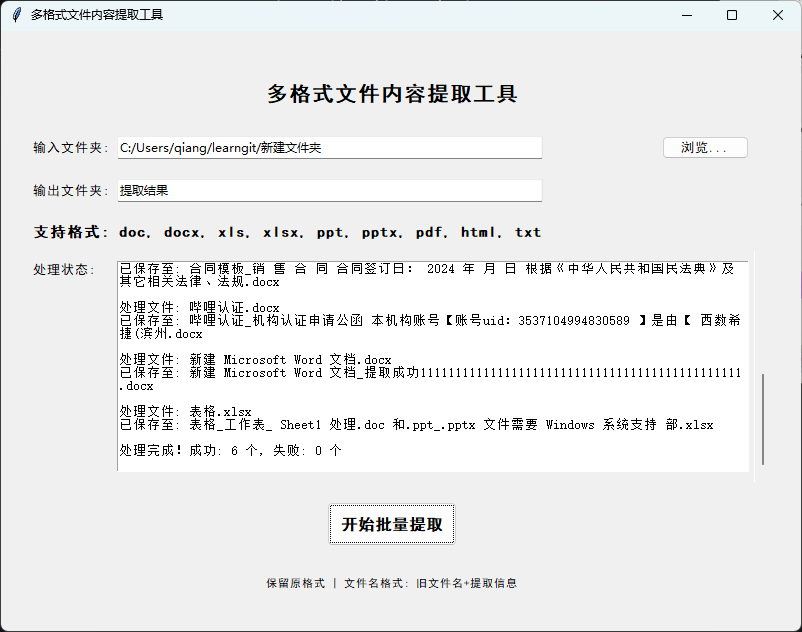

# MyAiCode

### V0.1版工具功能总结
该工具是一款多格式文件批量处理工具，主要功能包括：
1. 支持处理多种doc、docx、xls、xlsx、ppt、pptx、pdf、html、txt等多种常见文件格式
2. 采用"旧文件名+提取信息"的格式命名新文件，提取信息优先为文件标题，无标题则使用内容前50个字符
3. 处理结果自动保存到输入文件夹下的指定子文件夹中，保留原文件格式
4. 提供图形化界面，包含文件夹选择、处理状态显示等功能，界面元素布局合理
5. 支持批量处理文件夹中的所有支持格式文件，并提供详细的处理状态反馈

### 完整提示词总结
1. 开发一个Python GUI工具，具有居中的界面，使用tkinter构建
2. 功能需求：
   - 支持选择输入文件夹进行批量处理
   - 支持处理doc、docx、xls、xlsx、ppt、pptx、pdf、html、txt格式文件
   - 自动提取文件中的标题作为识别信息，无标题则使用内容前50个字符
   - 保持原文件格式，新文件命名为"旧文件名+提取的信息"
   - 处理结果保存到输入文件夹下的新子文件夹中，子文件夹名称可自定义
   - 提供处理状态显示和结果统计功能

3. 界面要求：
   - 包含输入文件夹选择、输出子文件夹名称设置区域
   - 显示支持的文件格式说明，且该说明行字号加大
   - "开始批量提取"按钮加大并突出显示
   - 包含处理状态显示区域和底部信息说明

4. 技术要求：
   - 使用相应库处理不同格式文件（python-docx、pdfminer.six等）
   - 处理文件名中的非法字符和重复问题
   - 支持中文显示，处理不同编码的文本文件
   - 提供错误处理和用户提示

5. 打包要求：
   - 能通过pyinstaller打包为EXE文件，方便分发使用
   - 打包配置正确，包含所有必要依赖

这些提示词从功能、界面、技术实现等方面逐步明确了工具的需求，最终形成了V0.1版的多格式文件批量处理工具。
